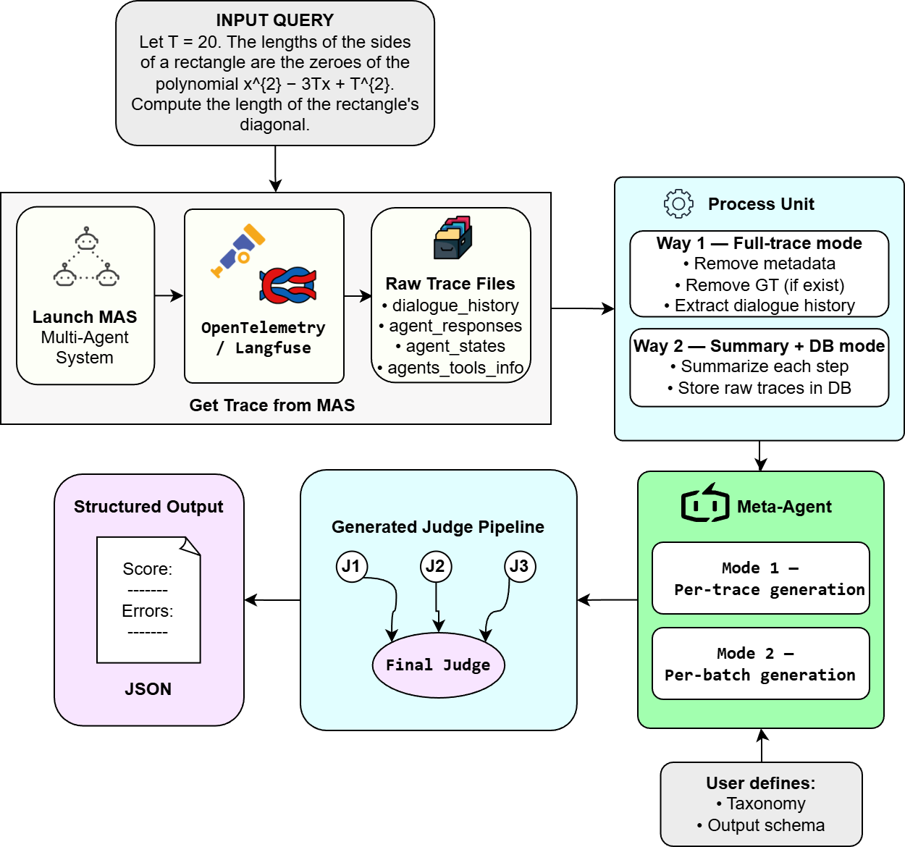
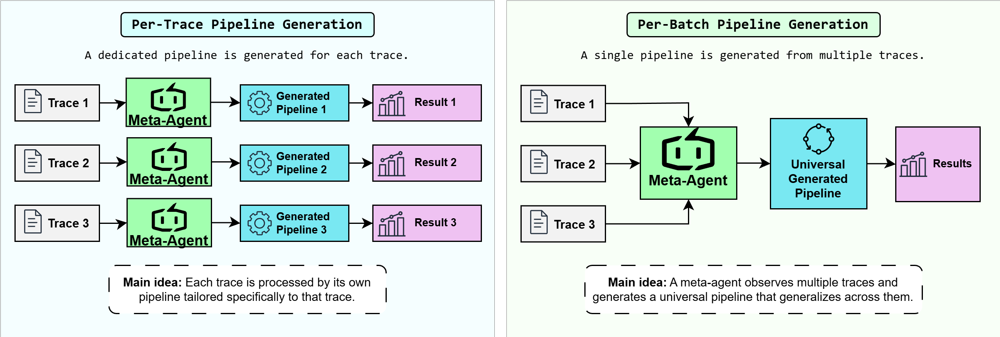
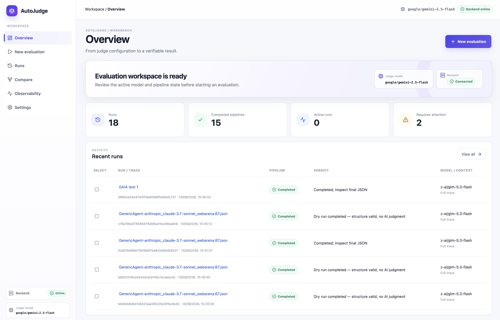

# AutoJudge: Adaptive LLM-Judge Pools for Multi-Agent Evaluation

<p align="center">
  <a href="https://huggingface.co/spaces/jrzkaminski/autojudge-demo"></a>
  <a href="https://youtu.be/I-8M8lY7VAQ"></a>
  
  
</p>

Official repository for the paper:

> **AutoJudge: Adaptive LLM-Judge Pools for Multi-Agent Evaluation**

- 🖥️ **Live demo:** https://huggingface.co/spaces/jrzkaminski/autojudge-demo
- 🎬 **Video:** https://youtu.be/I-8M8lY7VAQ

---

## Overview

Evaluating LLM-based multi-agent systems (MAS) from execution traces is hard: traces are long, failure modes are diverse, and existing judges are hand-built per benchmark. New agent benchmarks now appear faster than custom judges can be built by hand.

**AutoJudge removes this per-benchmark engineering step.** A researcher supplies only:

1. an **evaluation taxonomy**,
2. a desired **output schema**.

Given a trace, a **MetaAgent** writes the roles and instructions of several intermediate judges and one aggregation judge — a *trace-conditioned judge pool* inside a **fixed, inspectable evaluation graph** (intermediate judges run in parallel and feed one aggregator). The judges then execute as schema-constrained LLM calls with automatic retries on format violations, producing a structured, evidence-grounded verdict.



```text
Trace + Taxonomy + Output Schema
                ↓
            MetaAgent  (writes judge roles & instructions)
                ↓
   Judge pool in a fixed graph  (parallel judges → final aggregator)
                ↓
     Structured, evidence-grounded verdict (JSON)
```

No benchmark-specific prompt engineering, no optimization loop, no labeled development data.

---

## How It Works

1. **Trace ingestion.** A MAS execution trace (e.g., captured via OpenTelemetry/Langfuse, or loaded from a benchmark dataset) is prepared in one of two ways:
   - **Full-trace mode** — the raw trace is passed to every judge for maximal fidelity;
   - **Summary + DB mode** — each step is summarized ([`meta_agents/summary_agent.py`](src/autojudge/meta_agents/summary_agent.py), [`step_by_step_summarizer.py`](src/autojudge/meta_agents/step_by_step_summarizer.py)), the raw trace is stored in PostgreSQL ([`db/`](src/autojudge/db)), and judges retrieve individual steps on demand through the `get_content` tool ([`db/db_tools.py`](src/autojudge/db/db_tools.py)). This scales to traces beyond standard context windows (we have processed traces past 2M tokens).
2. **Judge-pool generation.** [`PoolGenerator`](src/autojudge/meta_agents/pool_gen.py) (the MetaAgent) reads the trace, taxonomy, and output schema and emits a list of judge specifications — name, instructions, model — including one mandatory `FINAL_AGGREGATOR`.
3. **Evaluation graph.** The graph stays fixed and inspectable: all intermediate judges run in parallel and feed the aggregator ([`get_parallel_graph`](src/autojudge/meta_agents/graph_gen.py)). An LLM-based [`GraphGenerator`](src/autojudge/meta_agents/graph_gen.py) with structural validation is also available.
4. **Execution.** [`PipelineBuilder`](src/autojudge/pipeline/pipeline_builder.py) compiles the pool and graph into a DAG [`Pipeline`](src/autojudge/pipeline/pipeline.py) that executes level-parallel, tracks tokens and cost, renders itself as a Mermaid diagram, and (optionally) logs every run to Langfuse.

All LLM calls go through [OpenRouter](https://openrouter.ai/) via [pydantic-ai](https://ai.pydantic.dev/) with structured outputs and automatic retries, so any OpenRouter-served model can back the MetaAgent or the judges. In the paper's experiments the MetaAgent is Gemini 3 Flash Preview and the judges/aggregator are Gemini 2.5 Flash.

### Per-trace vs. per-batch generation

The MetaAgent runs in one of two modes, trading off cost against per-trace adaptation:



- **Per-trace (default):** a dedicated judge pipeline is generated for every trace — best when traces are heterogeneous.
- **Per-batch (budget mode):** one pipeline is generated from a small batch of traces and reused across the dataset — the better default only when traces are homogeneous and budget is tight.

---

## AutoJudge Workbench (Demo)

The web interface provides an overview of evaluation runs, completed pipelines, and their verdicts. Visitors pick a preset GAIA trace or upload their own JSON, set an evaluation objective with a markdown taxonomy and a structured output schema, and launch AutoJudge. The generated judge pipeline is visualized as a directed graph — named judges like `source_factuality` and `constraint_completion` feeding into a `final_aggregator` — validated before execution, with each run's structured verdict surfaced on the Runs page.



Try it live: **https://huggingface.co/spaces/jrzkaminski/autojudge-demo** (video walkthrough: https://youtu.be/I-8M8lY7VAQ).

---

## Installation

Requirements: **Python ≥ 3.11** (3.12 recommended, see `.python-version`), [uv](https://docs.astral.sh/uv/), and — only for summary + DB mode — a running PostgreSQL instance.

```bash
git clone https://github.com/ITMO-NSS-team/AutoJudge.git
cd AutoJudge
uv sync
```

To also install benchmark tooling (HF `datasets`, `deepeval`, etc.):

```bash
uv sync --group benchmarks
```

### Configuration

Copy the environment template and fill in your keys:

```bash
cp .env.template .env
```

Variables actually read by the code:

```dotenv
# Required — all LLM calls are routed through OpenRouter
OPENROUTER_API_KEY=sk-or-...

# MetaAgent (judge-pool generation)
POOL_GEN_MODEL=google/gemini-2.5-flash   # any OpenRouter model id
POOL_GEN_TEMPERATURE=0.3                 # required by PoolGenerator

# Graph generation (only if you use the LLM GraphGenerator)
GRAPH_GEN_MODEL=google/gemini-2.5-flash

# Judges (pipeline nodes)
AGENT_NODE_MODEL=google/gemini-2.5-flash
AGENT_NODE_TEMPERATURE=0.1

# Optional — Langfuse tracing of every pipeline run
LANGFUSE_PUBLIC_KEY=
LANGFUSE_SECRET_KEY=
LANGFUSE_HOST=

# Summary + DB mode only — PostgreSQL trace store
DB_NAME=maseval
DB_USER=postgres
DB_PASSWORD=
DB_HOST=localhost
DB_PORT=5432

# Optional — access to HF-hosted benchmark datasets
HF_TOKEN=
```

Langfuse is optional: with the three `LANGFUSE_*` variables set, every run is instrumented and traceable; without them, pipelines execute normally with tracing disabled.

---

## Quick Start

Define *what* to evaluate (taxonomy) and *how* to report it (output schema) — AutoJudge builds the judge pipeline for you:

```python
import asyncio

from autojudge.meta_agents import PoolGenerator
from autojudge.meta_agents.graph_gen import get_parallel_graph
from autojudge.meta_agents.prompts import examples_no_tools
from autojudge.pipeline import PipelineBuilder

taxonomy = """
1) Guilty agent
2) Step of error
"""

output_schema = """
Return ONLY a valid JSON object:
{
  "agent": "name of the agent responsible for the failure",
  "step": "integer index of the failing step",
  "reason": "evidence-grounded explanation"
}
"""

judge_input = {
    "query": "<the original task given to the evaluated MAS>",
    "history_for_evaluating": [
        # list of trace steps: dicts with agent name, role, content, ...
    ],
}

async def main():
    # 1. MetaAgent writes the judge pool for this trace
    pool_gen = PoolGenerator(
        output_schema=output_schema,
        taxonomy=taxonomy,
        examples=examples_no_tools,
    )
    pool = await pool_gen.create_pool(judge_input)

    # 2. Fixed topology: parallel judges -> FINAL_AGGREGATOR
    graph = get_parallel_graph(pool)

    # 3. Compile and execute the pipeline
    pipeline = PipelineBuilder().create_from_pool(pool, graph).build()
    print(pipeline.to_mermaid_lr())          # inspect the generated graph

    verdict = await pipeline.ainvoke(judge_input)
    print(verdict)                           # structured JSON verdict

asyncio.run(main())
```

Ready-made taxonomies and output schemas for the paper's benchmarks live in
[`src/autojudge/meta_agents/prompts/output_schema_prompts/`](src/autojudge/meta_agents/prompts/output_schema_prompts)
(`ww_bench.py`, `trail_bench.py`, `aegis_bench.py`, `ae_bench.py`, `webarena_bench.py`, `pumpkin_bench.py`).

A complete worked example — a real Who&When-style trace, the judges AutoJudge generated for it, their prompts, and the final verdict — is in [`example.md`](example.md).

### Long traces: summary + retrieval mode

For traces that don't fit a context window:

1. Ingest raw traces into PostgreSQL with the per-benchmark scripts in [`src/autojudge/db/create_db/`](src/autojudge/db/create_db), e.g.:

   ```bash
   uv run python -m autojudge.db.create_db.create_db_ww
   ```

2. Create the pool with `PoolGenerator(..., use_summary=True)` — judges are then equipped with the `get_content` tool and fetch full step content by `state_id` on demand, while receiving only compact per-step summaries in their prompt.

---

## Reproducing the Paper's Experiments

Each benchmark has its own launcher(s) and metric script under [`examples/`](examples):

| Benchmark | Evaluation objective | Scripts |
|---|---|---|
| Who&When | Guilty-agent and step attribution | [`examples/who_and_when/`](examples/who_and_when) |
| TRAIL | Failure localization | [`examples/trail/`](examples/trail) |
| Aegis | Coordination and validation | [`examples/aegis/`](examples/aegis) |
| AgentErrorBench | Fine-grained error categorization | [`examples/agent_error_bench/`](examples/agent_error_bench) |
| AgentRewardBench (WebArena) | Reward-style trajectory judging | [`examples/agent-reward-bench/`](examples/agent-reward-bench) |
| Pumpkin | Trajectory classification | [`examples/pumpkin/`](examples/pumpkin) |

The typical workflow, e.g. for Who&When:

```bash
# full-trace mode
uv run python examples/who_and_when/auto_judge_launch_who_and_when.py

# summary + DB mode (ingest traces into PostgreSQL first)
uv run python -m autojudge.db.create_db.create_db_ww
uv run python examples/who_and_when/auto_judge_launch_who_and_when_summ.py

# metrics over the saved per-trace JSON results
uv run python examples/who_and_when/calculate_metrics_who_and_when.py
```

Launchers stream per-trace results to `results/<experiment>/` as JSON (one file per trace), skip already-processed traces on restart, and log failed traces for retries. Single-LLM judge baselines are in [`examples/baseline/`](examples/baseline). For WebArena data preparation, see [`examples/agent-reward-bench/README_DATA_PREP.md`](examples/agent-reward-bench/README_DATA_PREP.md).

> **Note:** some launchers log experiments through the Langfuse judge client from the `maseval` package, which is temporarily unavailable as a dependency (see the commented group in `pyproject.toml`). The core `autojudge` library does not depend on it.

### Key results

- On a controlled Who&When comparison (all systems backed by Gemini 2.5 Flash), AutoJudge leads on step accuracy in every setting and on hand-subset agent accuracy.
- Across seven benchmarks — Who&When, TRAIL, Aegis, AgentErrorBench, AgentRewardBench, AgenTracer, and Pumpkin — AutoJudge outperforms benchmark-specific evaluators on **14 of 19** within-benchmark metrics, using each benchmark's own metric, backbone, and protocol.
- Cost vs. accuracy: per-trace generation wins on heterogeneous traces (WW Algo), while per-batch reuse is more cost-efficient on homogeneous ones (WW Hand).

---

## Repository Structure

```text
.
├── src/autojudge/
│   ├── meta_agents/                 # MetaAgent: judge-pool generation & trace summarization
│   │   ├── pool_gen.py              #   PoolGenerator — writes judge roles/instructions
│   │   ├── graph_gen.py             #   parallel topology + LLM GraphGenerator w/ validation
│   │   ├── summary_agent.py         #   whole-trace summarization
│   │   ├── step_by_step_summarizer.py
│   │   ├── steps_batch_summarizer.py
│   │   └── prompts/                 #   pool/graph/summarization prompt templates
│   │       └── output_schema_prompts/  # per-benchmark taxonomies & output schemas
│   ├── pipeline/                    # DAG runtime: AgentNode, PipelineBuilder, Pipeline
│   ├── db/                          # PostgreSQL trace store for summary + retrieval mode
│   │   ├── db_tools.py              #   get_content tool judges call to fetch raw steps
│   │   └── create_db/               #   per-benchmark trace ingestion scripts
│   ├── judge_eval/                  # judge-quality evaluation utilities
│   ├── optimizers/                  # (experimental) prompt optimizers, incl. evolutionary
│   ├── utils/                       # logging, Langfuse integration
│   ├── agent_pool.py                # AgentPool container
│   └── main.py                      # high-level entry point
├── examples/                        # benchmark launchers, baselines & metric scripts
├── tests/                           # pytest suite
├── docs/images/                     # figures used in this README
├── example.md                       # end-to-end worked example (trace → judges → verdict)
├── pyproject.toml                   # uv/hatchling project definition
└── justfile                         # dev task runner (lint, format, tests, mypy)
```

---

## Development

```bash
uv sync                # install with dev group
just lint              # ruff check
just format-sort       # ruff format + import sorting
just tests             # pytest
just mypy              # strict type checking
```

Pre-commit hooks (`ruff` check/format, `validate-pyproject`) are configured in `.pre-commit-config.yaml`.
